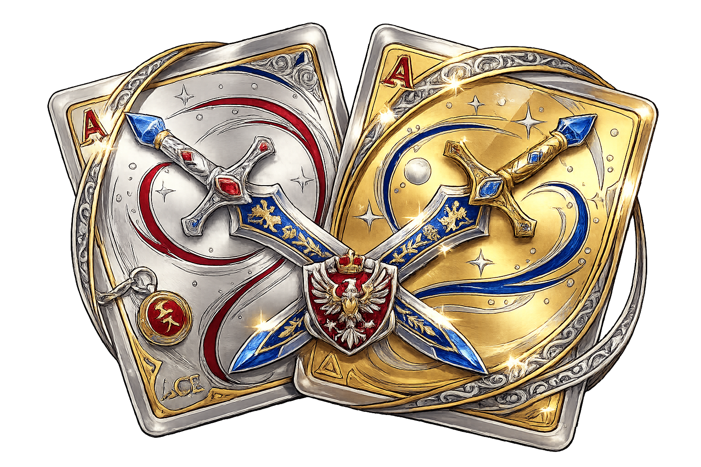

<div align="center">



# CargoGame Ecosystem

**Juego de cartas estratégico + herramientas de desarrollo + sistema de modding**

[](https://react.dev/)
[](https://www.typescriptlang.org/)
[](https://tauri.app/)
[](LICENSE)

</div>

---

## Descripción

**CargoGame Ecosystem** reúne el juego principal y dos herramientas complementarias orientadas al desarrollo, balance y creación de contenido.

El proyecto está pensado como un ecosistema extensible: el juego puede funcionar con contenido base, mientras que las herramientas auxiliares permiten inspeccionar datos, validar contenido y crear mods sin tener que modificar directamente el núcleo del juego.

Actualmente el repositorio contiene tres aplicaciones independientes:

| Componente | Ruta | Propósito |
|---|---|---|
| 🎮 Juego principal | [`cargov1a/`](./cargov1a/) | Juego de cartas estratégico, multijugador y extensible |
| 🔧 Dev Tool | [`devbuild-synergy-app-development/`](./devbuild-synergy-app-development/) | Herramientas de inspección, pruebas y balance |
| 🛠️ Modding Tool | [`moddingtools/`](./moddingtools/) | Creación y edición visual de contenido/mods |

---

## Características principales

### 🎮 Juego

- Juego de cartas con personajes, habilidades, pasivas, combos, trampas y efectos.
- Combate con fases de ataque y defensa.
- Bots con diferentes niveles de dificultad.
- Partidas FFA o por equipos.
- Estadísticas de partida y seguimiento de acciones.
- Parámetros configurables de críticos, cartas por turno, mano, defensa y otras reglas.

### 🌐 Multijugador

- Comunicación P2P mediante WebRTC.
- Partidas LAN/VPN.
- Soporte para múltiples jugadores.
- Host con autoridad sobre el estado principal de la partida.
- Lobby, chat y sincronización del estado.
- Comprobación de contenido/mods utilizado por el host.

### 🧩 Sistema de modding

El motor admite contenido adicional mediante archivos y paquetes externos.

Entre los formatos contemplados se encuentran:

- `.json`
- `.zip`
- `.cargasmod`
- carpetas de mods con recursos locales

Los mods pueden incorporar, según su estructura:

- cartas;
- personajes;
- combos;
- imágenes;
- sonidos;
- efectos;
- temas visuales;
- paneles adicionales del menú.

También existe un sistema de efectos modular y un motor de fórmulas para definir comportamientos de cartas de forma extensible.

Consulta la guía completa:

- [`TUTORIAL_MODDING.md`](./cargov1a/TUTORIAL_MODDING.md)
- [`ECOSYSTEM_ARCHITECTURE.md`](./cargov1a/ECOSYSTEM_ARCHITECTURE.md)
- [`BRIDGE_PROTOCOL.md`](./cargov1a/BRIDGE_PROTOCOL.md)
- [`INSTALLER.md`](./cargov1a/INSTALLER.md)
- [`PACKAGING.md`](./cargov1a/PACKAGING.md)

---

## Herramientas del ecosistema

### 🛠️ Modding Tool

Aplicación independiente orientada a facilitar la creación de contenido para CargoGame.

Su objetivo es permitir trabajar con estructuras de mods y recursos sin depender exclusivamente de edición manual de archivos.

Ruta:

```text
moddingtools/
```

### 🔧 Dev Tool

Aplicación independiente para tareas de desarrollo, inspección y pruebas.

Está orientada a apoyar procesos como:

- validación de datos;
- pruebas de fórmulas;
- análisis de contenido;
- revisión de balance;
- trabajo con archivos del ecosistema.

Ruta:

```text
devbuild-synergy-app-development/
```

---

## Tecnologías

El ecosistema utiliza principalmente:

- React
- TypeScript
- Vite
- Tauri
- Rust
- Zustand
- Framer Motion
- Tailwind CSS
- WebRTC / simple-peer
- JSZip

---

## Instalación para desarrollo

### Requisitos

Necesitas tener instalados:

- Node.js
- npm
- Rust
- dependencias de compilación requeridas por Tauri para tu sistema operativo

Clona el repositorio:

```bash
git clone https://github.com/DaiGeass/CargoGame-Ecosystem.git
cd CargoGame-Ecosystem
```

### Juego principal

```bash
cd cargov1a
npm install
npm run dev
```

Para ejecutarlo como aplicación Tauri:

```bash
npm run tauri:dev
```

Para compilar:

```bash
npm run build
npm run tauri:build
```

### Dev Tool

```bash
cd devbuild-synergy-app-development
npm install
npm run dev
```

o:

```bash
npm run tauri:dev
```

### Modding Tool

```bash
cd moddingtools
npm install
npm run dev
```

o:

```bash
npm run tauri:dev
```

---

## Estructura general

```text
CargoGame-Ecosystem/
├── cargov1a/                         # Juego principal
│   ├── public/mods/                  # Mods de ejemplo / contenido
│   ├── src/                          # Frontend y lógica del juego
│   ├── src-tauri/                    # Aplicación de escritorio
│   ├── BRIDGE_PROTOCOL.md
│   ├── ECOSYSTEM_ARCHITECTURE.md
│   ├── INSTALLER.md
│   ├── PACKAGING.md
│   └── TUTORIAL_MODDING.md
│
├── devbuild-synergy-app-development/ # Dev Tool
│   ├── src/
│   └── src-tauri/
│
├── moddingtools/                     # Modding Tool
│   ├── src/
│   └── src-tauri/
│
├── CargoGame.png
├── DevToolCargo.png
└── moddingtool.png
```

---

## Seguridad y contenido externo

CargoGame permite cargar contenido creado por terceros y utiliza comunicación de red para el modo multijugador.

Por ello:

- instala únicamente mods de fuentes en las que confíes;
- revisa contenido externo antes de distribuirlo;
- no consideres la autoridad del host como un sistema antitrampas completo;
- evita utilizar partidas o mods no confiables con información sensible.

El proyecto se encuentra en desarrollo y no debe interpretarse como software auditado de seguridad.

---

## Estado del proyecto

El proyecto se encuentra en **desarrollo activo**.

La arquitectura, formatos de mods, interfaces y herramientas pueden cambiar entre versiones.

---

## Contribuir

Las contribuciones son bienvenidas.

1. Haz un fork del repositorio.
2. Crea una rama:

```bash
git checkout -b feature/mi-cambio
```

3. Realiza tus cambios.
4. Crea commits descriptivos.
5. Envía la rama a tu fork.
6. Abre un Pull Request.

Ejemplo:

```bash
git commit -m "feat(modding): add new card effect validator"
```

---

## Licencia

Este proyecto se distribuye bajo **GNU General Public License v3.0 or later (`GPL-3.0-or-later`)**.

Consulta [`LICENSE`](./LICENSE).

Copyright © 2025–2026 **DaiGeass**.

---

## Autor

Desarrollado por **DaiGeass**.

GitHub: [@DaiGeass](https://github.com/DaiGeass)
